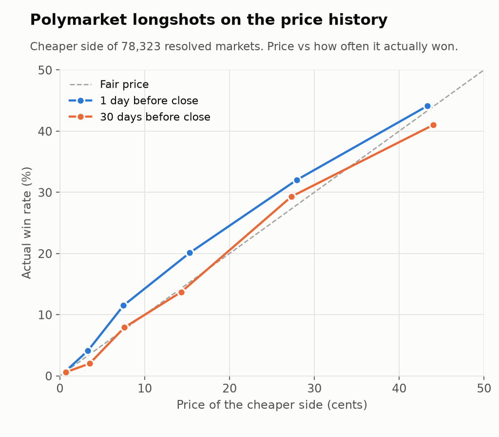
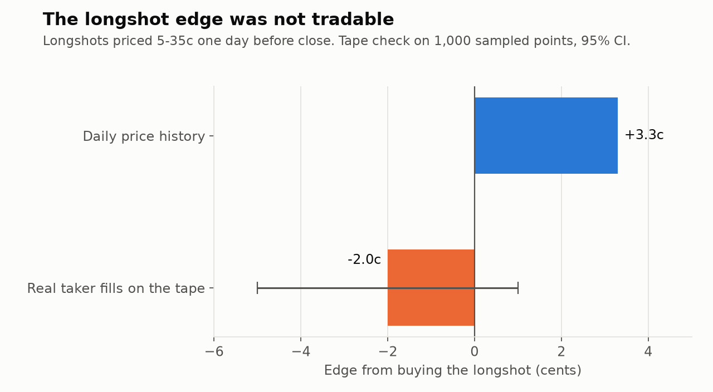

# Prediction Market Research

A search across all of Polymarket for a strategy that survives real costs. About 230,000 active markets at the time. I tested taker strategies, arbitrage and market making for the venue's liquidity rewards. None of them made it to real money, and the reasons were more useful than the strategies.

## What I built

- Fetchers for the market universe, resolved markets and the reward program
- A full-depth order book recorder (websocket, sharded, running as a service) that collected five days of L2 on the top 150 reward markets
- An order book rebuild that matches the exchange's own best bid and ask 99.99% of the time
- A quoting simulator on the recorded books, with queue position, latency, inventory skew, pulling quotes on fast moves, daily reward share and maker rebates
- A calibration study on 78,323 resolved markets, with confidence intervals clustered by event

## Longshots: the price history lied

On daily price history, cheap outcomes one day before close look underpriced by about 3 cents. That looks like a clean taker edge.

Then I checked the actual trade tape. Only about half of those points had any real buyer within two hours, and on the ones that did, the real entry price was worse than the outcome. The edge flipped to about -2 cents.

The history carries stale last-trade prices and placeholder prices on new markets. The same problem made a crypto strike strategy look very profitable against Deribit options: only 8 of 106 signals could actually have been traded.

## Liquidity reward market making

Polymarket pays makers for resting quotes near the mid. The first simulation, on a 14-day trade tape, showed adverse selection eating about half the rewards, with the rest still positive. The full simulation on recorded L2 was harsher. Losses to informed flow and news jumps ate all of it, and markets that did well in the fitting days didn't keep doing well in the test days. Around the same time the program cut long-dated reward rates by about 65% and the total pool fell from $239k to $156k a day.

## Other results

| Idea | Result |
|---|---|
| Multi-outcome basket arbitrage | Dead. 17 of 4,498 events had any gap, all on thin books |
| Crypto strike markets vs Deribit implied vol | Efficient. Median gap to fair value 0.5c |
| Short-horizon taker strategies | Dead on the real tape |
| Liquidity reward market making | About zero after adverse selection, then rewards were cut |

## Takeaways

- Never backtest on price history alone. Check it against the trades that really happened.
- Rewards are the venue's to change. A strategy that depends on them needs a wide margin.
- Split fitting days from test days for market selection too, not only for parameters.

## Stack

Python, asyncio websockets, pandas, systemd services, Polymarket CLOB, Gamma and data APIs, Deribit public API.

Code is proprietary. More of my work: [work-portfolio](https://github.com/mjaun556-svg/work-portfolio)
